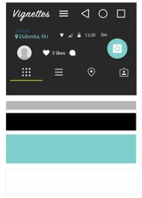
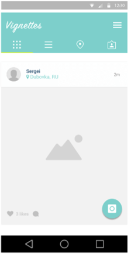

# Artigo Atomic Design - Rafael Barzotto

##### Unoesc Chapecó
##### Pós-graduação em Desenvolvimento Web, Cloud e dispositivos Móveis - WebMob
##### Disciplina: HTML5+CSS3
##### Professor: Jean Carlo Nascimento
##### Acadêmico: Rafael Barzotto
##### E-mail: {rafabarzotto@hotmail.com}
----------------

##### Resumo

É uma metodologia para desenvolvimento de layoults usando modulos de interface, desenvolvido por Brad Frost que a partir de uma aula de quimica viu que as paginas web se comportam como átomos, moleculas e organismos. Desse modo, criou um paradigma para desenvolvimento web onde a junção dos elementos menores formam um todo.

##### O que é?

A ideia é criar os modulos do layout em pedaços, para que no final se torne algo concreto, assim como a matéria, na quimica. Para isso foi definido os componentes que se encaixam nas categorias propostas, átomos, moleculas e organismos.
Este método se aplica melhor para a criação de sistemas web, do que para páginas comuns e simples.

##### Como funciona?

Como foi dito, no atomic design os elementos são dividos em módulos sendo:

O Átomo, o menor componente que na web pode ser um elemento HTML, em sequencia,
As moleculas que são um conjunto de átomos e aí
Os organismos que são várias moleculas agrupadas.
Após isso pode-se ter os templantes e as páginas.

Caracterizado como os Átomos estão por exemplo:
Icones, cores, fontes, logos, textfields, tabelas

Definido como moleculas estão:
Formulários, artigos, acordions, paginação

E como organismos temos:
Cabeçalho, rodapé, sessões, menus

Ainda entram mais dois elementos para completar o método, que são: o template e a página.
O template é a junção de diversos organismos, mas mostrando de uma maneira simples como o esqueleto da página ainda em produção, sem a presença dos textos, conteudos e imagens propriamente ditas.

E por fim a página que é a versão concreta do que se formou a partir de todos os elementos, com a adição dos conteúdos, imagens, e dinâmica.

##### Pra que usar?

Além da organização que o atomic design fornece, deixando o código mais limpo, o que torna mais fácil a detecção de erros, ajustes, testes, e reuso ele também fornece um padrão para o desenvolvimento, pois em todo projeto existe um padrão e um processo a ser seguido, por exemplo na construção de um carro. Foi o que Frost queria estabelecer para o desenvolvimento web.

##### Onde usar?

##### Exemplos

###### Moléculas

###### Organismo

###### Template (Modelo)

###### Página

##### Referências:

(http://atomicdesign.bradfrost.com/chapter-2/)
(http://patternlab.io/resources.html)

----------------
